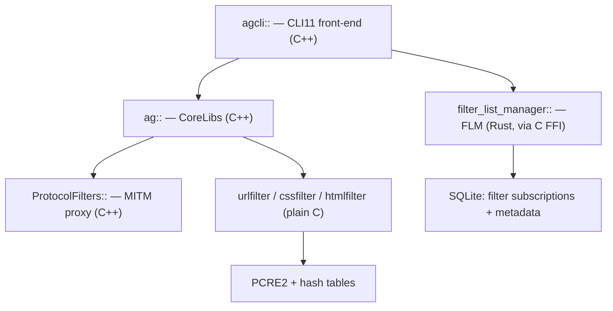

# Writeup 1 — Cracking open `adguard-cli` (no prior RE needed)

## 0. What "reverse engineering" means here

We are **not** decompiling to source. We are doing *static triage*: reading
the parts of a compiled program that the compiler was forced to leave in
plaintext. A surprising amount survives. Our goal is a **specification**, not
a source dump — we want to know *what the thing does* so we can build our own.

Ladder of effort, cheapest first. We stopped at rung 4; that was enough.

| Rung | Technique | Cost | What we got |
|---|---|---|---|
| 1 | `file`, `readelf` | seconds | static C++ + protobuf |
| 2 | `strings` | seconds | 78 329 strings |
| 3 | RTTI demangling | minutes | 773 class names → architecture |
| 4 | `__func__` mining + targeted `objdump` | ~1 h | engine API + algorithm |
| 5 | Full decompile (Ghidra/IDA) | days | not needed |

---

## 1. First contact

```
$ file adguard-cli
ELF 64-bit LSB executable, x86-64, statically linked,
BuildID[sha1]=c7e7c4c2..., stripped
```

Four facts, four consequences:

- **statically linked** — every dependency is baked in. 26 MB. Bad for them
  (nothing hidden behind `libfoo.so`), good for us: the whole dependency tree
  is sitting in one file.
- **stripped** — `.symtab` deleted. No function names… *from the symbol table*.
  We will get them from somewhere else.
- **ELF64 / x86-64** — standard Linux, `objdump` works.
- **BuildID** — a SHA-1 of the build. Useless to us, but it's how you'd match
  a binary to debug symbols if AdGuard ever published them.

Section headers are where it gets interesting:

```
$ readelf -S adguard-cli
  .text .rodata protodesc_cold .eh_frame .gcc_except_table
  .tdata .tbss .init_array .data.rel.ro .got .got.plt .data .bss
```

- `.gcc_except_table` + `.eh_frame` → **C++ with exceptions enabled**.
  This is the single most important observation in the whole exercise.
  Read on.
- `protodesc_cold` → **Google Protocol Buffers** linked in.
- No `.dynsym`, no `.plt` for external calls → confirms static.

> **Lesson:** section names are a fingerprint. `protodesc_cold` only appears
> if you link protobuf. `.gcc_except_table` only appears with C++ exceptions.
> You can identify a binary's toolchain and half its libraries before
> disassembling a single instruction.

---

## 2. Why "stripped" is a lie for C++

`strip` removes `.symtab`. It **cannot** remove RTTI.

When a C++ program uses `dynamic_cast`, `typeid`, or throws exceptions
through a class hierarchy, the compiler emits a `type_info` object for each
polymorphic class. Every `type_info` holds a pointer to the **mangled class
name as a plain string in `.rodata`**. The runtime needs that string at
runtime, so the linker can never discard it and `strip` never touches it.

Exceptions guarantee this: `catch (const MyError &e)` compiles to a runtime
type comparison, which needs `typeinfo for MyError`, which needs the name.

So:

```bash
strings -n 6 adguard-cli > strings_all.txt

# Itanium ABI: nested names are N<len><part><len><part>...E
grep -oE '\bN[0-9][0-9A-Za-z_]{4,300}E\b' strings_all.txt | sort -u \
  | sed 's/^/_Z/' | c++filt
```

`c++filt` expects a full symbol, so we glue a fake `_Z` prefix on the front —
the demangler then happily decodes the name fragment.

**773 class names recovered from a stripped binary.**

### The namespace census

```
228  ag::                    AdGuard core
120  google::                protobuf
 86  filter_list_manager::   subscription management
 56  agcli::                 the CLI front-end
 29  CLI::                   CLI11 (arg parsing)
 15  ProtocolFilters::       the MITM engine
 13  bssl::                  BoringSSL
 10  __cxxabiv1::
  6  __gnu_cxx::
  5  nlohmann::              JSON
  4  pugi::                  pugixml
  4  google_breakpad::       crash reporting
  3  fmt::                   {fmt} formatting
  3  ada::                   Ada URL parser
  1  AGSocks5Listener
```

That is a **bill of materials** for a proprietary product, obtained in about
90 seconds. Note `ada::` — a WHATWG-compliant URL parser. That tells us they
take URL normalisation seriously enough not to hand-roll it; we should too.

---

## 3. A third language shows up

Buried in the strings:

```
/root/.cargo/registry/src/index.crates.io-.../url-2.5.7/src/lib.rs
```

Rust panic messages embed the source path. Mining them:

```
adguard-flm-2.3.3   adguard-flm-ffi-2.3.5   hyper-1.8.1   rustls
tokio   sqlx?/rusqlite   cssparser-0.34.0   nom-7.1.3   clubcard-0.3.2
aho-corasick-1.1.4   blake3   chrono   idna   lru-0.6.6 ...
```

So the real shape is **three languages in one binary**:



Confirmed by the error strings `FFI call failed for method {}` and
`FLM method {} returned an error: {}` — a C ABI boundary between the C++ core
and the Rust list manager.

`clubcard-0.3.2` is the giveaway for **CRLite** (Mozilla's compressed
certificate-revocation structure). Cross-checked against the strings
`CRLite database updated` and `https://crlite-records.adtidy.org/...`.

---

## 4. The trick that unlocked everything: `__func__`

The class names gave us *architecture*. They did not give us *algorithms*,
because the hot filtering core is **plain C**, and C has no RTTI.

But it has logging. Look at the shape of ~2 300 format strings:

```
{}: ...shortcuts table found {} rules
{}: ...thirdparty check failed
{}: Bailing on complex pattern: `{}`
```

Every one begins `{}: `. That leading `{}` is a **function name**, supplied by
a logging macro:

```c
#define log_dbg(fmt, ...)  log(LVL, "{}: " fmt, __func__, __VA_ARGS__)
```

`__func__` is a compiler-generated `static const char[]`. It lives in
`.rodata`, right next to the format strings that use it, and **`strip` cannot
remove it** — the code loads its address at runtime.

So: dump strings *with file offsets*, take the region where the log formats
live, and keep every token that looks like a C identifier.

```bash
strings -n 3 -td adguard-cli > strings_off.txt
awk '$1>18000000 && $1<24500000' strings_off.txt | awk '{print $2}' \
  | grep -xE '[a-z_][a-z0-9_]{5,50}' | grep -E '_' | sort -u
```

**1 528 C function names.** The engine's entire public API, for free:

```
urlfilter_alloc              urlfilter_addrule
urlfilter_search_shortcuts   urlfilter_search_leftovers
urlfilter_search_domains_for_host
match_rules_from_table       match_rule_pattern     match_url
rulecommon_extract_regex_shortcut  rulecommon_parse_modifiers
extract_rule_mask            extract_rule_domains   compile_wildcard
cssfilter_alloc  cssfilter_addrule  cssfilter_buildcss
htmlfilter_alloc htmlfilter_addrule
urlfilter_applyremoveparam   urlfilter_applyreplace
urlfilter_applyredirect      urlfilter_applyurltransform
urlfilter_applycookie_request
```

> **Lesson:** logging is the biggest information leak in any stripped binary.
> A `__func__`-based log macro effectively re-exports your symbol table.
> The log *messages* then narrate the algorithm line by line.

---

## 5. Reading actual machine code (only where it paid)

We wanted one number the strings would not give us: how the shortcut
extractor decides a pattern is "too complex".

**Step 1 — find the string's virtual address.** Parse the ELF program
headers to build an `offset ↔ vaddr` map, then locate the bytes:

```
"{}: Bailing on complex pattern: `{}`"  →  file 0x11bba58  →  vaddr 0x15bba58
```

**Step 2 — find who references it.** x86-64 addresses `.rodata` with
RIP-relative operands: `lea rdx,[rip+disp32]`. The CPU computes
`target = address_of_next_instruction + disp32`. Invert it: for every byte
offset `p` in `.text`, read the 4 bytes at `p` as a signed `disp32` and test

```
TEXT_ADDR + p + 4 + disp32 == target_vaddr
```

Vectorised with NumPy over all 18 MB, four unaligned passes, ~1 second.
Yields the exact instruction that loads the string. That is a **cross-
reference finder in 15 lines** — the core feature of IDA/Ghidra, hand-rolled.

**Step 3 — disassemble the neighbourhood.**

```bash
objdump -d --start-address=0x785a60 --stop-address=0x785b80 -M intel adguard-cli
```

```asm
785a90:  cmp    cl,0x7c                  ; is char '|' ?
785a93:  jne    785ab8
785ab8:  movsx  esi,cl
785abb:  lea    rdi,[rip+0xe70be6]       ; 0x15f66a8 = ".?*+^$"
785ac2:  call   0x158e2e0                ; strchr(".?*+^$", c)
785ac7:  test   rax,rax
785aca:  jne    785833                   ; metachar → segment break
785b2c:  lea    rdx,[rip+0xe35f25]       ; "Bailing on complex pattern"
```

Read it in English: *walk the pattern; `|` means alternation → give up
entirely; any of `. ? * + ^ $` ends the current literal run.*

The constant `".?*+^$"` is the answer we came for. Notice `[` and `(` are
absent — handled elsewhere, via PCRE2 callouts (see Writeup 2).

---

## 6. What we walked away with

| Question | Answer | How |
|---|---|---|
| Language / toolchain | C++17 + Rust + C, GCC, static | `readelf`, Rust paths |
| Dependencies | BoringSSL, PCRE2, nghttp2/3, ngtcp2, libuv, SQLite, protobuf, ada, pugixml, nlohmann, fmt, CLI11, Breakpad | RTTI + strings |
| Architecture | MITM proxy + DNS proxy + C rule engine | RTTI class names |
| Rule grammar | ~40 modifiers, full cosmetic syntax | parser error strings |
| Matching algorithm | 3-table index, ordered cheap→expensive checks | `__func__` + log messages |
| Shortcut heuristic | longest literal run, break on `.?*+^$`, bail on `\|` | xref + `objdump` |

**Nothing here required a decompiler.** The binary told on itself through
RTTI, `__func__`, and log strings — three things a C++ codebase with
exceptions and debug logging cannot avoid emitting.

Next: [Writeup 2 — the filter engine](02-filter-engine.md).
