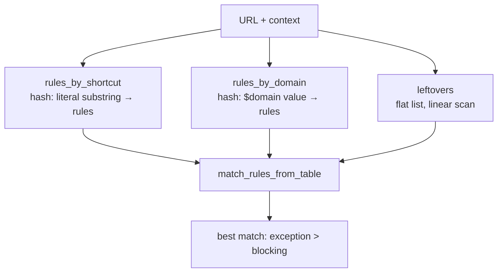

# Writeup 2 — The filter engine, recovered from log strings

Everything here is derived from `__func__` names, ~2 300 log format strings,
and one targeted disassembly. Where I inferred rather than observed, it says
so.

---

## 1. The problem the engine actually solves

A browser loading one page fires 50–300 requests. You have ~150 000 filter
rules. Naive matching = 45 million string comparisons *per page*. The entire
design exists to avoid that.

The log messages spell out the answer:

```
{}: -> examining rule {}
{}: ...url doesn't contain shortcut ({})
{}: ...shortcuts table found {} rules
{}: ...domains table found {} rules for {}
{}: ...leftovers table found {} rules
{}: SHOULD NOT HAPPEN: empty value for rules_by_shortcut table!
{}: SHOULD NOT HAPPEN: url '{}' -- empty value for rules_by_domain table!
```

plus the function names

```
urlfilter_search_shortcuts
urlfilter_search_domains_for_host
urlfilter_search_leftovers
match_rules_from_table
```

**Three indexes, tried in order.** Not one big list.

---

## 2. Rule anatomy

```
    @@ ||example.com ^/ads/ * .js $ script,third-party,domain=~foo.com
    ─┬  ─┬─────────── ──────┬────   ─┬──────────────────────────────
     │   │                  │        └─ modifiers (~40 of them)
     │   │                  └────────── pattern body
     │   └───────────────────────────── anchors
     └───────────────────────────────── exception marker
```

Anchor semantics (standard Adblock Plus, confirmed by the parser messages):

| Token | Meaning |
|---|---|
| `\|\|` | domain anchor — matches scheme + optional `www.` + subdomains |
| `\|` at start / end | hard start-of-URL / end-of-URL anchor |
| `^` | separator: any char not in `[a-zA-Z0-9_.%-]`, or end-of-URL |
| `*` | wildcard, any run |
| `/…/` | the whole pattern is a raw regex |
| `@@` | exception (allowlist) |
| `!` or `[` first | comment |

The parser reports `Modifier cannot start with \`||\`` and
`Doesn't start with \`[$\` - considering it has no modifiers`, which pins
down both the modifier delimiter and the newer `[$modifier]cosmetic` prefix
form.

---

## 3. Shortcut extraction — the load-bearing idea

Before a rule is stored, the engine extracts its **longest literal
substring** ("shortcut"). Observed:

```
{}: Pattern: `{}`, longest shortcut: `{}`
{}: extracted shortcut: {}
{}: Bailing on complex pattern: `{}`
{}: Too wide rule: {}
```

Disassembly of the extractor (Writeup 1 §5) gives the exact rule:

```asm
cmp cl, 0x7c            ; '|'  → bail on the whole pattern
lea rdi,[rip+...]       ; ".?*+^$"
call strchr             ; any of these → end current literal run
```

So:

- Walk the pattern.
- `. ? * + ^ $` terminate the current literal run and start a new one.
- `|` (alternation, in regex rules) → **give up**, rule becomes a "leftover".
- Keep the longest run.
- Runs that are too short → "Too wide rule", also a leftover.

For **regex rules** (`/foo\d+bar/`) they do something cleverer. The mangled
lambda name

```
_Z33rulecommon_extract_regex_shortcut...UlP31pcre2_callout_enumerate_block_8E_
```

shows the callback takes a `pcre2_callout_enumerate_block`. They compile the
regex with PCRE2 and call `pcre2_callout_enumerate()` to walk the *compiled
pattern's* structure, pulling literal runs out of it. That is far more
accurate than string-scanning the regex source. Neat trick; we won't copy it
(we'll do the simpler string scan), but it's worth knowing.

**Why this works:** matching becomes "does the URL contain this literal
substring?" — an Aho-Corasick / hash-lookup question, not a regex question.
Only rules whose shortcut is present in the URL get the expensive treatment.

---

## 4. The three tables



- **`rules_by_shortcut`** — the bulk. Key: extracted literal. Lookup: slide
  over the URL, probe every substring (or run Aho-Corasick once).
- **`rules_by_domain`** — rules pinned to a `$domain=` value with no useful
  URL shortcut. Key: the domain. `urlfilter_search_domains_for_host` walks
  the host's parent domains (`a.b.example.com` → `b.example.com` →
  `example.com` → `com`).
- **`leftovers`** — regex rules with alternation, pure-wildcard patterns,
  anything unindexable. Linear scan. Keeping this bucket tiny is the whole
  game.

There is also `clear_rule_by_shortcut` and `rulecommon_storage_remove_rule_by_text`
— dynamic add/remove without a full rebuild.

---

## 5. The match pipeline — cheapest test first

This is the sequence of failure messages, in binary order. It *is* the
algorithm:

```
{}: -> examining rule {}
{}: ...url doesn't contain shortcut ({})      ← 1. substring presence
{}: ...thirdparty check failed                ← 2. bool compare
{}: ...request type check failed              ← 3. bitmask AND
{}: ...request method check failed            ← 4. bitmask AND
{}: ...domain check failed                    ← 5. domain list walk
{}: ...appname check failed                   ← 6. (desktop only)
{}: ...headers check failed                   ← 7. header regex
{}: ...url was not matched against rule pattern  ← 8. FULL PATTERN / PCRE2
{}: ...popup compatibility failed
{}: ...rule is excluded from matching
{}: Rule is disabled by $badfilter, returning URLFILTER_NOTFOUND
{}: URL '{}' matched rule '{}'!
```

Note the ordering discipline: an integer bitmask test (`$script`,
`$third-party`) runs *before* the domain-list walk, which runs *before* the
regex. **Every check is ordered by cost.** Copy this exactly.

`$badfilter` is a post-filter: a rule that disables another rule by text
match. It's applied at the end (`Couldn't remove badfilter from rule {}`).

### Result vocabulary

```
filter result is BLOCK | PASS | CONTINUE | DONE | WAIT_ASYNC | WAIT_FULL_BODY
chain  result is CHAIN_CONTINUE | CHAIN_STOP | CHAIN_PAUSE | CHAIN_DESTROY
```

`WAIT_FULL_BODY` matters: `$replace` and HTML filtering can't stream, so the
engine buffers the whole response first — `Content modifying rules should be
applied -- waiting full body`.

---

## 6. Modifier surface

Recovered from `extract_*` function names and per-modifier log lines
(`Called with rule: {} -- option {}`):

**Content type** (bitmask): `script image stylesheet object font media
xmlhttprequest subdocument websocket webrtc ping document popup other`

**Matching constraints**: `domain= from= to= denyallow= method= app=
match-case third-party header= important badfilter`

**Response/request rewriting**:
| Modifier | `extract_*` fn | Effect |
|---|---|---|
| `$removeparam` | `removeparam_extract` | strip query params |
| `$removeheader` | `extract_removeheader` | strip a header |
| `$replace` | `extract_replace` | regex s/// on the body |
| `$urltransform` | `extract_urltransform` | regex s/// on the URL |
| `$redirect` / `$redirect-rule` | `extract_redirect` | serve a local stub resource |
| `$csp` | `extract_csp` | inject Content-Security-Policy |
| `$permissions` | `extract_permissions` | inject Permissions-Policy |
| `$cookie` | `cookie_rule_extract_modifiers` | drop/shorten cookies |
| `$referrerpolicy` | `extract_referrerpolicy` | override referrer policy |
| `$jsonprune` / `$xmlprune` | `extract_jsonprune` | prune JSON/XML by path |
| `$hls` | `extract_hls` | strip ad segments from HLS playlists |
| `$stealth` | `extract_stealth` | privacy header rewriting |

The `$hls` one is how they kill video pre-rolls: rewrite the `.m3u8`
playlist before the player sees it. `Response body doesn't start with an HLS
magic line, response unmodified`.

---

## 7. Cosmetic filtering

Separate engines: `cssfilter_*` (CSS selectors) and `htmlfilter_*` (HTML
element removal, DOM-side).

The conversion regexes are stored verbatim in `.rodata` — uBlock-syntax
rules get rewritten to AdGuard syntax at load time:

```
(.*)(##\+js\()((?!\/.*\/)[ -~]*?(?:,(?:[^/]+)|(?:/.+?/))?)(?<!\\/)\)(.*)$
(.*)(##script:inject\()...
^(.*?)##(.*?):style\((.*?)\)(.*)$
^(.*?)##(.*?):matches-media\((.*?)\):style\((.*?)\)(.*)$
(.*)(##\^responseheader\()...
```

Masks:

| Mask | Meaning |
|---|---|
| `##` | element hiding (CSS `display:none`) |
| `#@#` | element-hiding exception |
| `#?#` | extended CSS (`:has()`, `:contains()`) |
| `#$#` | CSS injection (arbitrary declarations) |
| `#%#` | JS injection |
| `#%#//scriptlet` | named scriptlet |
| `$$` / `$@$` | HTML filtering (strip element server-side) |
| `[$path=/re/]` | path-scoped cosmetic rule |

`cssfilter_buildcss` builds **one big stylesheet** per document from all
matching generic + domain-specific selectors, then it's injected into the
page. `Called with {}, generics are {}, specifics are {}` confirms the
generic/specific split (needed for `$generichide`).

The HTML filter is a streaming SAX-style parser — `on start element {}`,
`on end element {}`, `Element {} ({}-{}) does not have an end tag`,
`collapsed element {} ({}-{}) with rule {}`. It rewrites the byte range in
place while streaming, which is why it tracks `({}-{})` offsets.

---

## 8. What we will build

Our target is learncpp.com, which needs exactly two of the above:

1. **Network blocking** — kill `www.ezojs.com/ezoic/sa.min.js`,
   `g.ezoic.net`, `solutions.cdn.optable.co`, `googlesyndication`,
   `doubleclick`.
2. **Cosmetic hiding** — the page ships 9 inline
   `<span id=ezoic-pub-ad-placeholder-NNN>` elements. Blocking the network
   request alone leaves 9 blank gaps. We need CSS injection.

So the minimum viable engine is: pattern matcher + `$domain`/`$third-party`/
content-type modifiers + `##` element hiding + CSS injection into HTML
responses. Everything else (`$replace`, `$hls`, scriptlets, HTML filtering)
is a later extension on the same skeleton.

Design decisions we are copying verbatim:

- longest-literal shortcut extraction, break on `.?*+^$`, bail on `|`
- three-table index (shortcut / domain / leftovers)
- cheap-to-expensive check ordering
- exception rules beat blocking rules; `$important` beats exceptions

Next: [Writeup 3 — interception](03-interception.md).
