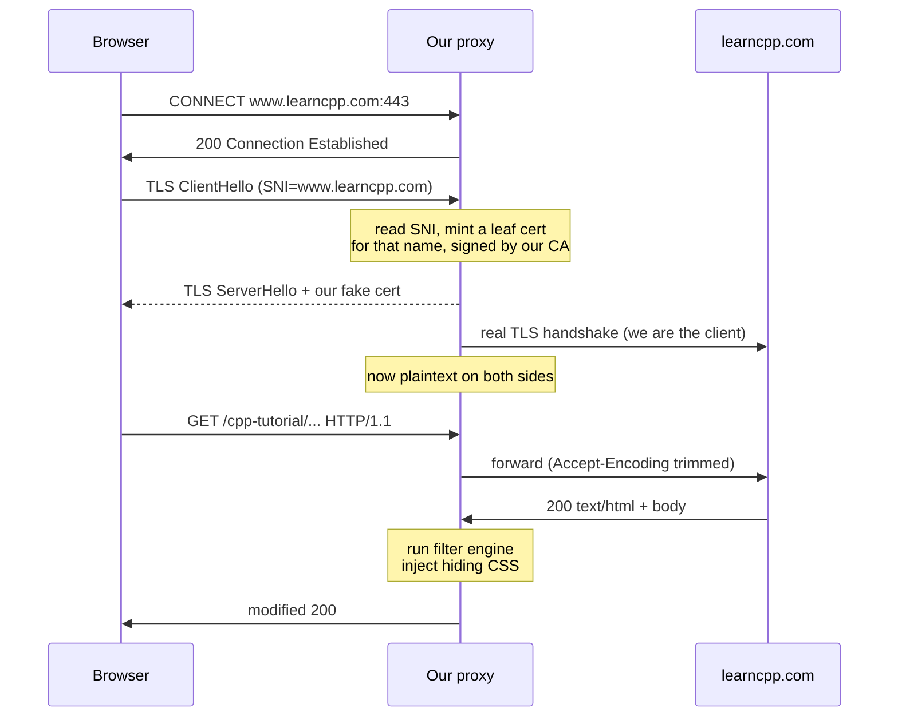

# Writeup 3 — How it gets between you and the internet

A filter engine is useless if you can't see the traffic. Modern web traffic
is TLS-encrypted end to end. This writeup is about how AdGuard breaks into
that stream, and which of it we need to copy.

---

## 1. Three interception modes

From the log strings:

```
{}: SOCKS5 proxy server is listening at {}
{}: Automatic proxy server is listening at {}
{}: Automatic proxy is set up on port {} (DNS port: {})
{}: Setting up auto proxy (redirect port: {}, DNS port: {}, {} port range(s))
{}: New manual proxy connection from client {}
{}: New auto proxy connection from client {}
{}: New internal proxy connection from client {}
{}: [id={}] New SOCKS5 connection from {}
```

| Mode | Mechanism | Needs root | Client config |
|---|---|---|---|
| Manual | HTTP `CONNECT` proxy on a port | no | yes — set proxy in browser/OS |
| SOCKS5 | `AGSocks5Listener` | no | yes |
| Automatic | `iptables -t nat REDIRECT` to a local port | **yes** | none |

"Automatic" is transparent interception: a root helper installs NAT rules
so outbound :80/:443 is redirected to the local proxy. The strings
`Root helper check: owned_by_root={}, has_suid={}` and
`Sending get_privileged_socket request` show a small setuid helper that
passes bound sockets back over a Unix socket via `SCM_RIGHTS` — the main
process stays unprivileged. Good design.

There's also a route-loop guard (`Address {} is in route loop -- reject
session`) because the proxy's own outbound connections would otherwise be
redirected back into itself. If you build a transparent proxy, you will hit
this bug; remember it exists.

**We will build manual-mode only.** No root, no NAT rules, no loop guard,
and Firefox/Chrome both take a proxy setting. That is the entire difference
in complexity between a weekend project and a systems project.

---

## 2. The MITM, step by step



The critical asymmetry: **the browser trusts our CA, the origin server does
not know we exist.** Two independent TLS sessions, plaintext in the middle.

### Certificate minting

`AGCertificateVerifier`, `CertificateManagerImpl`, and messages like
`Certificate generated: {}`, `Can't generate certificate for {} ({})`,
`Failed to generate CA certificate` describe the flow:

1. On first run, generate a self-signed CA (`AdGuard Personal CA`).
2. User installs it into the OS/browser trust store
   (`https://kb.adguard.com/technical-support/how-to-install-certificate`).
3. Per connection: read SNI → look up a cached leaf cert → if absent, mint
   one on the fly signed by the CA, cache it in an LRU
   (`LruCache<std::string, ...>`, `Couldn't open cert cache`).

They *also* verify the **real** server certificate themselves
(`AGCertificateVerifier`, OCSP, SCT/Certificate-Transparency, CRLite,
`Using default_verifier` / `Using application_verifier`). This matters: once
you MITM, the browser can no longer see the true cert, so the proxy inherits
the entire responsibility for TLS security. If you skip this, you have
*downgraded* the user's security. We will verify with the system trust store
and refuse to proxy on failure.

### When they refuse to intercept

A long list of bail-outs, each one a hard-won compatibility lesson:

```
Not filtering this TLS connection because '{}' has EV certificate
Not filtering this TLS connection because {} is in list of domains not to filter
Client is authenticating with a certificate, will not filter this connection
Received certificate_required({}) alert from the server, will not filter
TLS connection is not HTTPS, adding '{}' to exceptions
TLS connection may not be filtered because CA cert is not recognized by application
SSLFilter::{} Not filtering this TLS connection because of ESNI
SSLFilter::{} Weak DH prime, do not filter such connections
```

Translation: **certificate pinning and mutual TLS defeat MITM, and you must
detect that and fall back to a blind byte tunnel.** The pattern is: try to
filter; on handshake failure, add the host to an exception set and passthrough
next time. Banking apps, Slack, and anything with pinned certs land here.

### QUIC

```
Blocking HTTP/3 via SVCB/HTTPS (https_filtering=on, http3_filtering=off)
Connection should be filtered but HTTP/3 filtering is not enabled, blocking QUIC
{}: Blocking QUIC
```

HTTP/3 runs over UDP and is much harder to intercept. The pragmatic answer:
**block QUIC so the browser falls back to TCP**, where you can MITM. They
additionally strip `h3` ALPN hints from DNS SVCB/HTTPS records
(`RemoveH3AlpnAction`). We get this for free — a browser talking to an
explicit HTTP proxy does not use QUIC.

---

## 3. The processing chain

`ProtocolFilters::` + the `AG*ProcessingUnit` classes form a pipeline of
composable stream filters:

```
AGProxySession
  └─ ProtocolFilters::Proxy
       ├─ SSLFilter               TLS terminate / re-originate
       ├─ AGHttp12ProcessingUnit  HTTP/1.1 + HTTP/2 (nghttp2)
       ├─ AGHttp3ProcessingUnit   HTTP/3 (nghttp3 + ngtcp2)
       ├─ AGHttpFilteringUnit     ← calls the filter engine
       │    ├─ AGFilterNetwork        block / allow
       │    ├─ AGFilterHeaders        $removeheader, $csp
       │    ├─ AGFilterContent        $replace, HTML filtering
       │    ├─ AGFilterStealthmode    header scrubbing
       │    └─ AGFilterSafebrowsing   phishing lists
       ├─ AGHttpCompressor        gzip/deflate re-encode
       └─ AGContentEditor         inject CSS/JS into HTML
```

Each unit returns `CHAIN_CONTINUE / CHAIN_STOP / CHAIN_PAUSE / CHAIN_DESTROY`.
`CHAIN_PAUSE` is how async work (a DNS lookup, a Safe Browsing hash query)
suspends the stream without blocking the event loop.

Two implementation details worth stealing:

- **`AGHttpCompressor`** — you cannot filter a gzipped body. They decompress,
  filter, recompress. The cheap alternative, which we will use: rewrite the
  client's `Accept-Encoding` to `identity` for HTML documents only, so the
  server sends plaintext. Costs bandwidth on HTML only; saves an entire
  compression pipeline. (We keep gzip for everything we don't rewrite.)

- **`AGContentEditor`** — the CSS injection point. Log lines
  `building html head content` / `built html head content: {}` show they
  splice a `<style>` block into `<head>`. That is precisely what kills the
  Ezoic placeholder spans.

### Stealth mode

A free bonus, fully described by log strings:

```
'Do-Not-Track' header was injected in request
'Sec-GPC' header was injected in request
'X-Client-Data' header was removed from request
'Authorization' header was removed from request
'Referer' header was changed (orig={},new={})
'User-Agent' header was changed to '{}'
'ETag' header was removed from response
'If-None-Match' header was removed from request
third-party cookies were removed from request
```

ETag / If-None-Match removal is anti-supercookie — ETags are a cache-based
tracking vector. Ten lines of code, real privacy win. We'll include it.

---

## 4. What we are building

Scope, honestly bounded:

**In:**
- Explicit HTTP proxy (`CONNECT` + absolute-form GET) on `127.0.0.1:8080`
- Self-signed CA, on-the-fly leaf certs cached by SNI
- Real upstream certificate verification against the system store
- HTTP/1.1 only (we advertise only `http/1.1` in ALPN, so servers downgrade)
- Adblock rule parser + three-table matching engine
- Network blocking → `204 No Content` / empty image
- Cosmetic element hiding via `<style>` injection into HTML
- Stealth headers
- Passthrough tunnel on any handshake failure (pinning-safe)

**Out (deliberately):**
- HTTP/2, HTTP/3, QUIC — the proxy protocol makes browsers speak HTTP/1.1
  to us; upstream we also force 1.1. Slower, vastly simpler.
- Transparent/NAT mode, root helper, DNS proxy
- `$replace`, `$hls`, `$jsonprune`, scriptlets, extended CSS
- Safe Browsing, parental control, CRLite

HTTP/1.1-only is the single biggest simplification. It costs page-load
latency (no multiplexing) and buys us roughly 8 000 lines of nghttp2/ngtcp2
integration we don't have to write.

Next: the code.
