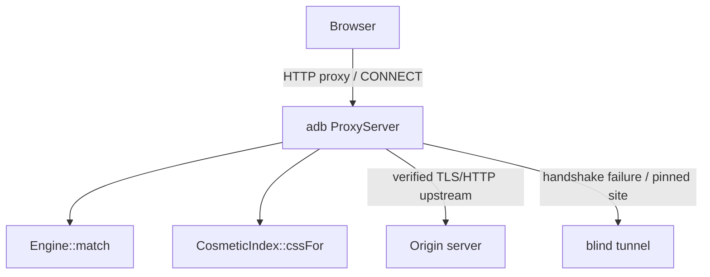
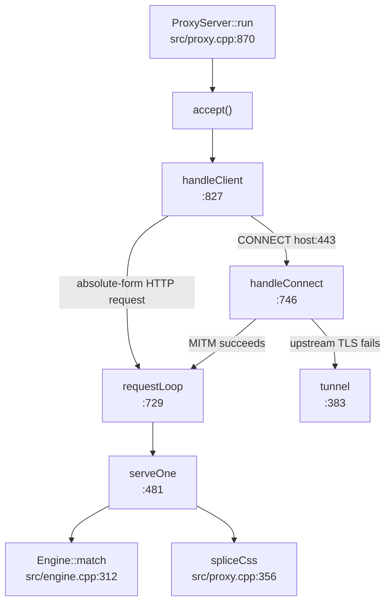

# Writeup 5 — Codebase map and upkeep notes

Last refreshed: 2026-08-09.

This is the practical map of the repo: where execution starts, where the major
ideas from the earlier notes landed in code, and what should be refreshed when
implementation changes.

---

## 1. What this application is

`adb` is a local HTTP/HTTPS filtering proxy. The browser is configured to use
`127.0.0.1:<port>` as its proxy. For HTTPS, `adb` accepts `CONNECT`, performs a
local TLS MITM using its own trusted CA, verifies the upstream server certificate,
runs Adblock-style network/cosmetic filters on plaintext HTTP/1.1, and sends the
possibly rewritten response back to the browser.

The short version:



---

## 2. Start reading here

`src/main.cpp` is the application entry point. It reads top-to-bottom as five
blocks:

| Lines | Responsibility |
|---:|---|
| `92-139` | parse CLI flags |
| `141-159` | set up or print the local CA |
| `161-185` | load filter lists and call `Engine::finalize()` |
| `187-213` | one-shot `--test` mode: match one URL and exit |
| `215-232` | create `ProxyServer`, run accept loop, print stats |

For understanding the filter engine, use `--test` first. It avoids TLS, sockets,
threads, and browser setup:

```bash
printf '||ezojs.com^$script\n@@||learncpp.com^$script\nlearncpp.com##div.cf_monitor\n' > /tmp/tiny.txt
./build/adb --filters /nonexistent --rules /tmp/tiny.txt \
  --test https://www.ezojs.com/ezoic/sa.min.js --source learncpp.com --type script -vv
```

`--rules` is additive; it does not replace `--filters`. Use a nonexistent
`--filters` path when you want a tiny isolated rule file.

---

## 3. Current file map

| File | Current size | Role |
|---|---:|---|
| `src/main.cpp` | 233 | CLI, filter loading, `--test`, server lifetime |
| `src/parser.cpp` | 568 | rule classification, network-rule parsing, PCRE2 wrapper, shortcut extraction |
| `src/engine.cpp` | 505 | rule storage, index build, match priority, cheap-to-expensive match pipeline |
| `src/cosmetic.cpp` | 467 | `##` / `#@#` cosmetic filters, token-reduced generic selector output |
| `src/proxy.cpp` | 949 | socket accept loop, CONNECT MITM, request/response loop, CSS injection, tunneling |
| `src/http.cpp` | 473 | HTTP/1.1 parse/serialize, body framing, chunked decoding, gzip helpers |
| `src/ca.cpp` | 510 | local CA, leaf certificate cache, OpenSSL server/client contexts |
| `src/url.cpp` | 172 | URL split, host normalization, subdomain/third-party helpers |
| `include/adb/*.hpp` | 591 | public contracts and the best high-level inline comments |
| `tests/*.cpp` | 1 454 | unit coverage for parser, engine, cosmetic, HTTP, URL, CA |
| `bench/bench.cpp` | 122 | standalone benchmark; currently not wired into CMake |

---

## 4. Runtime spine

The network path starts in `ProxyServer::run()` and fans inward:



`Conn` is the key local abstraction in `src/proxy.cpp:140`: `FdConn` and
`SslConn` both implement `read`/`write`/`close`, so the same `requestLoop()` and
`serveOne()` code handles plaintext and TLS.

`serveOne()` is the real request/response exchange. Its internal table of
contents is already in comments:

| Step | Lines | Meaning |
|---|---:|---|
| 1 | `485` | parse request head/body |
| 2 | `550` | derive document/source host for third-party checks |
| 3/4 | `560` | infer content type, build `Request`, call `engine.match()` |
| 5 | `577` | rewrite request headers for origin |
| 6 | `603` | connect/reuse upstream origin socket and read response head |
| 7 | `648` | strip/rewrite response headers, decide whether body is rewritable |
| 8 | `720` | serialize response back to client |

---

## 5. Filter engine shape

The notes describe the design as three indexes. The code currently has four
lookup structures:

| Structure | Code | Purpose |
|---|---|---|
| `byShortcut_` | `engine.cpp:150` | rarest 4-gram inside each shortcut -> candidate rules |
| `byShortcut3_` | `engine.cpp:151` | exact 3-byte shortcut -> candidate rules |
| `byDomain_` | `engine.cpp:152` | `$domain=` rules with no useful shortcut |
| `leftovers_` | `engine.cpp:153` | unindexable rules, linear scan |

The fourth table is intentional: the parser floor is 3 bytes, and keeping exact
3-byte shortcuts out of `leftovers_` avoids checking them on every request.

`Engine::finalize()` does the build:

1. apply `$badfilter` removals by normalized rule text;
2. split surviving rules into shortcut/domain/leftover groups;
3. count global 4-gram frequencies;
4. file each long-shortcut rule under its rarest 4-gram;
5. finalize the cosmetic token index.

`Engine::match()` is the hot path. Candidate rules are tested in this order:

1. shortcut presence / verified gram hit;
2. `$third-party`;
3. content-type bitmask;
4. `$method` bitmask;
5. `$denyallow`;
6. `$domain` include/exclude;
7. full pattern/regex match;
8. priority selection: `$important` block > exception > ordinary block.

---

## 6. Parser shape

`parser.cpp` owns three jobs:

- classify raw filter-list lines as comment, cosmetic, network, or unsupported;
- parse network rules into `Rule` fields;
- compile and test full patterns/regexes.

Shortcut extraction is the load-bearing optimization. For normal patterns it
walks the pattern, keeps the longest literal run, breaks on `.?*+^$`, and bails
on `|`. Regex rules use the same simplified extraction path here rather than the
full PCRE2 callout enumeration observed in AdGuard.

The PCRE2 wrapper keeps compiled regexes immutable and uses `thread_local` match
data, so `Engine::match()` can be called concurrently after `finalize()`.

---

## 7. Cosmetic filtering shape

`CosmeticIndex` supports:

- `example.com##.ad` domain-specific hiding;
- `##.ad` generic hiding;
- `example.com#@#.ad` exceptions;
- deliberate recognition-and-skip for unsupported masks such as `#?#`, `#$#`,
  `#%#`, and `$$`.

There are two stylesheet paths:

- `cssFor(host)` emits all generic selectors plus host-specific selectors;
- `cssFor(host, html)` token-reduces generics by scanning the already-held HTML
  for class/id tokens, then emits only selectors that can plausibly match.

The proxy uses the two-argument form for HTML responses so it does not inject the
full ~250 KB generic stylesheet into every page.

---

## 8. TLS and CA shape

`ca.cpp` handles local trust material and OpenSSL contexts:

- `CertAuthority::ensure(dir)` loads or creates `ca.crt` / `ca.key`;
- `leafFor(host)` mints and caches a leaf certificate signed by the local CA;
- `makeServerCtx()` is the browser-facing TLS server context;
- `makeClientCtx()` is the origin-facing TLS client context with upstream
  certificate verification.

`handleConnect()` first connects to the origin. If upstream TLS verification
fails, the host is marked `noMitm` and the connection falls back to a blind byte
tunnel. If upstream TLS succeeds, the proxy accepts browser-side TLS with a
minted leaf and then hands plaintext HTTP to `requestLoop()`.

---

## 9. HTTP/body handling shape

`http.cpp` owns pure HTTP helpers: no sockets, no OpenSSL, no filtering policy.

Important contracts:

- `parseRequestHead()` / `parseResponseHead()` return bytes consumed, `0` for
  incomplete, `-1` for malformed;
- `BodyPlan` classifies body framing as none, fixed length, chunked, or until
  close;
- `dechunk()` waits until the terminal zero-length chunk is present;
- `gzip()` / `gunzip()` are zlib helpers used by response rewriting.

The proxy buffers bodies only when it may need to rewrite them. Large opaque
fixed-length bodies stream through via `relayN()` rather than being held whole.

---

## 10. Upkeep checklist

When code changes, update these notes immediately:

- filter index structure changes -> `notes/02-filter-engine.md` and this file;
- match priority/check order changes -> `notes/02-filter-engine.md §5`;
- proxy threading, tunnel, or body-buffer thresholds change -> this file;
- CLI flags change -> `notes/04-results.md §7` and this file;
- benchmark numbers change -> `notes/04-results.md §5`, with machine/compiler;
- file sizes or module ownership change substantially -> this file §3;
- install paths, service lifecycle, proxy integration, or updater changes ->
  `notes/06-personal-deployment-roadmap.md`;

Current known documentation drift:

- `notes/02-filter-engine.md` and `include/adb/engine.hpp` still describe a
  three-table index, but `engine.cpp` now has the extra `byShortcut3_` table;
- `notes/04-results.md §6` line counts are stale after the latest cosmetic,
  engine, parser, and proxy changes;
- `bench/bench.cpp` is standalone and not a CMake target, so benchmark numbers
  need manual build instructions before they are fully reproducible.

Next: [Writeup 6 — personal desktop deployment roadmap](06-personal-deployment-roadmap.md).
