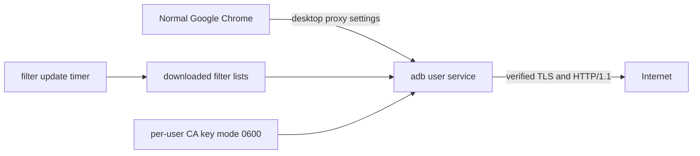

# Writeup 6 — Personal desktop deployment roadmap

Last refreshed: 2026-08-12.

This note records where `adb` is today and the next product milestone: make it an
always-available personal desktop ad blocker rather than a program that must be
started from a terminal with a specially launched browser.

The target is intentionally **personal Linux desktop deployment**, not a LAN
gateway, container service, browser extension, or transparent system-wide
interceptor.

---

## 1. Current status

The filtering path works end to end:

- `adb` builds as a C++ executable and has 103 passing tests;
- it loads the checked-in AdGuard lists plus `filters/custom.txt`;
- the engine accepts 279,835 network rules and 108,300 cosmetic rules from the
  current lists;
- the explicit proxy listens on `127.0.0.1:8080`;
- Chrome can route HTTP and HTTPS through it with `--proxy-server`;
- HTTPS interception uses a locally generated CA and verifies the real upstream
  certificate against the system trust store;
- matching requests receive a local `204 No Content` response with
  `X-Adb-Blocked: 1`;
- matching cosmetic selectors are injected into HTML responses;
- the live LearnCpp check blocks Ezoic, DoubleClick, Optable, Google Analytics,
  Google IMA, and related advertising traffic while preserving the article.

Today, trying it requires manual lifecycle management:

```bash
./build/adb --listen 127.0.0.1:8080 --filters filters -v

google-chrome \
  --proxy-server=http://127.0.0.1:8080 \
  --disable-quic
```

The temporary demo also used `--ignore-certificate-errors` because the automated
session could not answer the host's `sudo` password prompt. That flag is not an
acceptable deployed configuration. Normal use requires installing the adb CA in
Chrome's trust store and retaining normal certificate validation.

### What deployment support already exists

- `adb --print-ca` creates or loads the per-user CA.
- `scripts/install-ca.sh` can install or remove the CA from Chromium-family NSS
  databases and Firefox profiles when `certutil` is available.
- The proxy binds to loopback by default.
- CA key permissions are enforced by the implementation.
- The CLI exposes filter directory, extra rule file, CA directory, CSS, stealth,
  listen address, and one-shot matcher options.
- CMake installs the executable, an absolute-path user service template, and an
  example configuration file.
- Runtime defaults follow `XDG_CONFIG_HOME`, `XDG_DATA_HOME`, and
  `XDG_STATE_HOME`, with standard per-user fallbacks.
- An optional strict `adb.conf` supports listener, filter, custom-rule, CA,
  state, CSS, and stealth settings; CLI flags override configured values.
- Normal logging is warning-only; full request URLs require explicit verbose
  mode.
- `adb setup`, `status`, `doctor`, `disable`, and `uninstall` manage a GNOME
  user deployment without root privileges.
- Setup installs bundled initial lists, requires explicit CA consent, manages NSS
  trust, waits for the service listener, and only then enables the desktop proxy.
- Disable and uninstall restore the exact captured GNOME proxy values before
  stopping the service; failed setup rolls back service, proxy, and newly added
  trust state.

### What does not exist yet

- no automatic filter-list downloader or update timer;
- no runtime filter reload;
- no transparent interception mode.

The current application is now installed as an active per-user desktop proxy;
automatic updates and runtime reload remain future phases.

---

## 2. Personal deployment target

The intended user experience is:

```text
one-time setup
    -> explicitly generate and trust a per-user adb CA
    -> install and enable an adb user service
    -> configure the desktop to use 127.0.0.1:8080
    -> fetch the initial filter lists

normal login
    -> systemd starts adb automatically
    -> Chrome starts normally from the desktop launcher
    -> browser traffic is filtered without a terminal window

maintenance
    -> filter lists update atomically on a timer
    -> adb reloads only after a valid update is ready
    -> status and diagnostics are available from one command

uninstall
    -> restore the previous desktop proxy settings
    -> stop and remove the user service
    -> remove the trusted CA
    -> optionally delete the CA private key and downloaded lists
```

The normal runtime shape should be:



Expected installed state:

```text
~/.local/bin/adb                         executable for a local install
~/.config/adb/adb.conf                   user configuration
~/.config/adb/ca.crt                     public local CA certificate
~/.config/adb/ca.key                     private local CA key, mode 0600
~/.config/adb/custom.txt                 user-authored rules
~/.local/share/adb/filters/              downloaded public lists
~/.local/state/adb/                      updater/runtime state
~/.config/systemd/user/adb.service       background proxy service
~/.config/systemd/user/adb-update.timer  scheduled list updates
```

A packaged install may put the executable in `/usr/bin` instead. CA material must
remain per-user and must never be generated as a shared package asset.

---

## 3. Deployment decisions

### Explicit proxy first

The personal milestone will keep the current explicit HTTP proxy. Chrome will
obtain the proxy address from Linux desktop settings instead of a command-line
flag.

This gives normal browser startup without adding privileged packet interception.
The network route remains:

```text
Chrome -> HTTP CONNECT proxy on 127.0.0.1:8080 -> origin
```

Transparent `nftables`/TPROXY mode remains a later project. It requires a raw TLS
listener, original-destination recovery, SNI parsing, loop prevention, QUIC
handling, IPv6, privilege separation, and crash-safe firewall restoration. None
of that is required to make the existing proxy useful every day.

### Per-user service, never a root proxy

The main process will run as the logged-in user under `systemd --user`. Root is
not required for a loopback explicit proxy and would unnecessarily expose the CA
private key and request-processing code to greater privilege.

The service should be hardened with at least:

- `NoNewPrivileges=yes`;
- `PrivateTmp=yes`;
- a read-only system filesystem;
- write access limited to adb's XDG directories;
- loopback binding unless the user deliberately chooses otherwise.

### Explicit CA consent

Setup must explain that trusting `ca.crt` allows the holder of `ca.key` to mint a
certificate for any site. Installing a root CA must be an explicit action, not a
package post-install side effect.

Each machine generates its own CA. Deployment must never copy one private CA key
across devices.

`--ignore-certificate-errors` is excluded from the deployed design.

### Desktop integration starts with GNOME

The first adapter may target the current GNOME/Linux workstation through
`gsettings`. It must capture the previous proxy mode and values before changing
them and restore those exact values during disable or uninstall.

Other desktops, PAC policy, and browser-specific policy can be added after the
single supported path is reliable. Silent partial configuration across several
desktop environments is worse than one explicit supported adapter.

### Failure policy must be visible

Manual desktop proxy settings are naturally **fail-closed for connectivity**:
if adb is unavailable, Chrome reports `ERR_PROXY_CONNECTION_FAILED`. This avoids
silently bypassing filtering but can make normal browsing appear broken.

The first deployment will address this with an always-on, restartable user
service and a diagnostic command. A later optional PAC or Chrome policy may add
`DIRECT` fallback for users who prefer availability over fail-closed filtering.
That policy must be explicit because fallback means ads and trackers pass when
adb is down.

### Public lists are data, custom rules are configuration

Downloaded AdGuard lists belong under `~/.local/share/adb/filters/` and may be
replaced by the updater. User rules belong under `~/.config/adb/custom.txt` and
must never be overwritten.

Updates must be downloaded to temporary files, validated, and atomically renamed
into place. A failed or truncated download must leave the last known-good lists
active.

---

## 4. Implementation roadmap

The ordering below is deliberate. Each phase leaves a usable state and avoids
making browser routing depend on unfinished lifecycle code.

### Phase A — Stable installed layout (implemented)

Add:

1. a release-mode build/install path for the `adb` executable;
2. XDG-aware default paths for configuration, public lists, custom rules, CA,
   and state;
3. an `adb.conf` parser for stable service configuration;
4. CLI flags that continue to override configuration values;
5. an example user service file using absolute installed paths;
6. quiet normal logging, with full request URLs reserved for explicit verbose
   mode.

Acceptance:

- `adb` starts from outside the repository;
- it does not depend on `./filters` or `./build`;
- existing CLI behavior and one-shot `--test` mode remain available;
- the service runs unprivileged and binds only to loopback by default.

Implemented proof: a release build installed under an arbitrary prefix, ran
from `/tmp` with an external `adb.conf`, loaded the configured lists, and
returned `204 No Content` with `X-Adb-Blocked: 1` for a proxied DoubleClick
request. The unit suite passes 103 tests.

### Phase B — Setup, diagnostics, and teardown (implemented and deployed)

Add user-facing lifecycle commands or an equivalent companion tool:

```text
adb setup       generate CA, install service, fetch lists, configure proxy
adb status      show service/listener/filter/update state
adb doctor      verify trust, permissions, listener, filters, and proxy settings
adb disable     restore previous desktop proxy settings without deleting data
adb uninstall   disable, remove service and trusted CA, optionally purge data
```

`setup` must pause for explicit CA consent and provide a clear manual import path
when `certutil` is unavailable. It must not ask the program to handle or store a
sudo password.

`doctor` should report at least:

- whether port 8080 is listening;
- whether the service is active;
- whether the CA and private key parse;
- whether the private key has safe permissions;
- whether Chrome's NSS database trusts the expected CA fingerprint;
- how many filter rules were loaded and skipped;
- whether desktop proxy settings point to the active listener;
- when public lists were last updated.

Acceptance:

- after `setup`, Chrome opened normally from the desktop launcher filters
  LearnCpp without certificate warnings;
- after `disable`, Chrome connects directly and retains network access;
- after `uninstall`, the service, proxy settings, and trusted CA are gone;
- setup and teardown are idempotent.

Implemented proof: the installed `adb` dispatches all five lifecycle commands.
An isolated GNOME/NSS/systemd integration scenario covers setup twice, status,
doctor, disable twice, setup again, uninstall twice, optional purge behavior,
exact proxy restoration, CA trust removal, and rollback when service startup
fails. The installed systemd user unit passes `systemd-analyze --user verify`.
Live setup then installed and enabled the user service, preserved and replaced
the GNOME proxy settings in lifecycle order, and passed every `adb doctor`
check. Normal Chromium loaded the LearnCpp article without a certificate
warning; DoubleClick, Optable, Ezoic, and Google Analytics resource entries each
reported zero transferred and decoded bytes while article text, images, and code
highlighting remained intact.

### Phase C — Automatic filter updates

Add a small updater path plus a user systemd timer:

```text
adb update-filters
adb-update.service
adb-update.timer
```

Update transaction:

1. download every configured list over verified HTTPS;
2. write only into a private temporary directory;
3. reject HTTP errors, empty files, obvious HTML error pages, and implausibly
   small rule sets;
4. build/finalize a candidate engine or run an equivalent validation pass;
5. atomically replace the old public-list directory;
6. request a runtime reload;
7. retain enough metadata to report source URL, update time, and failure reason;
8. preserve the last known-good files on every failure path.

Acceptance:

- interruption during download cannot corrupt active lists;
- a malformed list cannot replace the active engine;
- `custom.txt` is untouched;
- offline updates fail without affecting browsing;
- the next successful update recovers automatically.

### Phase D — Zero-downtime reload

Add controlled runtime reload, preferably through `SIGHUP` or a local control
socket:

1. load and finalize a complete replacement `Engine` away from request threads;
2. publish it atomically only after success;
3. allow in-flight requests to finish against the old immutable engine;
4. keep the old engine active if parsing or finalization fails;
5. expose the active generation and load statistics to `status`/`doctor`.

Acceptance:

- filter updates do not interrupt browser connections;
- no request observes a partially built index;
- reload failure is logged and leaves the previous generation active.

### Phase E — Daily-use polish

Add:

- desktop notification only for actionable failures, not every blocked request;
- a simple way to pause/resume filtering while preserving service state;
- a local allowlist/custom-rule workflow;
- bounded, privacy-conscious logs;
- release archives or a `.deb` package;
- an end-to-end install/upgrade/uninstall check on a clean Linux user account.

Potential later additions:

- PAC or Chrome policy with optional `DIRECT` fallback;
- adapters for KDE and other desktop environments;
- local statistics that do not retain full browsing URLs;
- signed release artifacts and signed filter-source metadata;
- a small status UI, if the CLI and desktop notifications prove insufficient.

---

## 5. Service lifecycle invariant

The load-bearing deployment invariant is:

```text
Desktop proxy points at adb
    implies
adb is installed, enabled, and listening
```

Setup must not enable the desktop proxy before the service is ready. Uninstall
must restore proxy settings before stopping or deleting the service. A crash
cannot guarantee that invariant, so systemd restart behavior and `adb doctor`
are part of the product rather than optional operational polish.

The lifecycle order is:

```text
install:   executable -> data -> CA trust -> service ready -> proxy enabled
uninstall: proxy restored -> service stopped -> CA untrusted -> files removed
```

Reversing either sequence can strand the user without working browser access.

---

## 6. Security boundaries for personal deployment

The deployed version must retain these rules:

- never listen on `0.0.0.0` by default;
- never expose an unauthenticated open proxy to the LAN;
- never run the main proxy as root;
- never share or upload `ca.key`;
- never use `--ignore-certificate-errors` in the normal launcher or service;
- never disable upstream certificate verification;
- never log complete URLs by default;
- never overwrite custom rules during public-list updates;
- never leave modified desktop proxy settings behind after uninstall;
- never silently fall back to direct browsing unless the user selected that
  availability policy.

The service handles plaintext for every intercepted HTTPS request. Local process
security and log privacy are therefore part of the browser's security boundary.

---

## 7. Personal-deployment proof

The milestone is complete when a fresh Linux user can perform this flow:

1. install the package or local release;
2. run one documented setup command;
3. explicitly trust a newly generated per-user CA;
4. open normal Google Chrome from the desktop launcher;
5. load the LearnCpp target with no certificate warning;
6. observe zero transferred bytes from blocked ad hosts;
7. observe no visible ad frames or placeholder gaps;
8. retain intact article text, code highlighting, images, and first-party assets;
9. reboot or log out/in and obtain the same behavior without a terminal;
10. receive a filter update without interrupting browsing;
11. disable or uninstall and immediately regain direct browsing;
12. confirm the adb CA is no longer trusted after uninstall.

Until that flow works end to end, the project is a working proxy with deployment
scaffolding, not yet a personal desktop application.

---

## 8. Deliberate non-goals for this milestone

Do not let these expand the first deployment milestone:

- transparent `nftables`/TPROXY interception;
- HTTP/2 or HTTP/3 interception;
- LAN gateway or multi-user service;
- Docker deployment;
- mobile support;
- browser extension development;
- cloud control plane or synchronized CA keys;
- full AdGuard modifier/scriptlet compatibility;
- graphical configuration application.

They may be valid later projects. None is required to turn the current explicit
proxy into a safe, useful, always-on personal desktop blocker.
